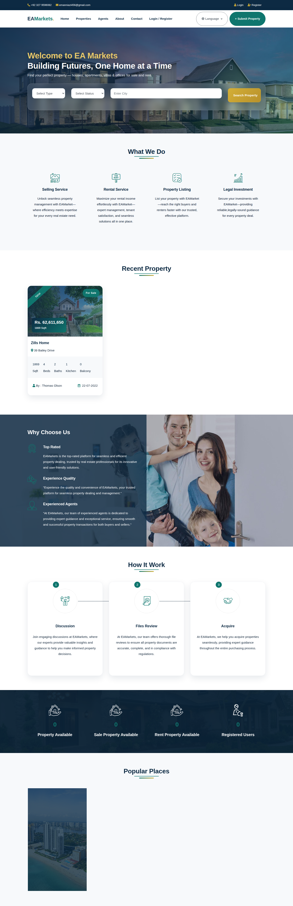
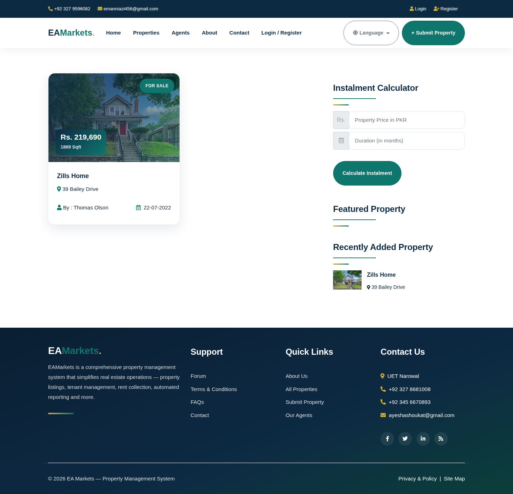
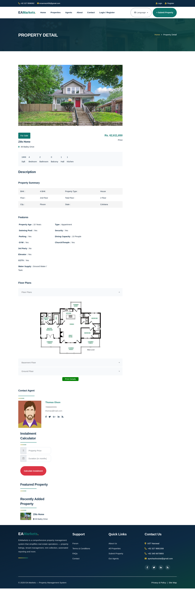
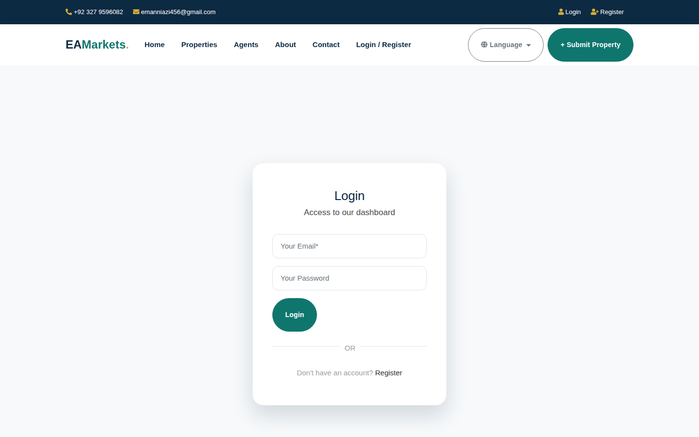
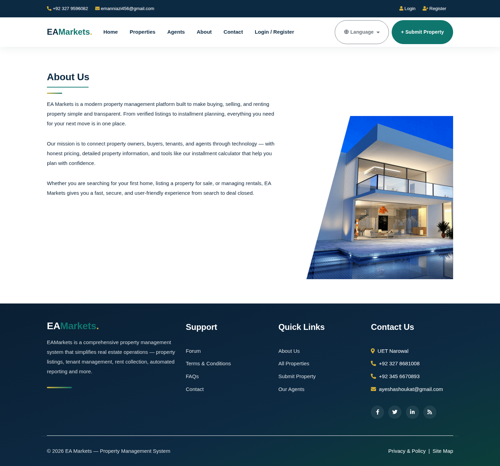

# 🏠 EA Markets — Property Management System

My **3rd-semester Web Engineering project** — a complete property management web application in **PHP & MySQL**, with a freshly redesigned modern frontend.

## ✨ Features

**For Visitors**
- 🏠 Browse property listings (sale / rent) with photos, prices & details
- 🔍 Filter properties by type, status and city
- 📄 Property detail pages: features, floor plans, agent contact
- 🧮 Installment calculator for payment planning
- 📍 Browse by state/city, view agents, about & contact pages

**For Registered Users**
- 👤 Register / login, manage profile
- ➕ Submit your own property listings
- 📊 Personal dashboard: your properties, feedback & activity

**For Admin**
- 🛠️ Full admin panel: manage properties, users, agents, cities, states
- 💬 View & reply to contact messages and feedback
- 📝 Manage site content (about page, etc.)

**Admin login:** `admin` / `admin123`

## 🎨 Frontend Redesign

The entire frontend was redesigned with a modern look while keeping all backend logic intact:
- Deep navy + teal + gold color palette
- Modern typography (Sora + Plus Jakarta Sans)
- Glassmorphism hero search card
- Rounded property cards with hover effects
- Modern sticky navbar & gradient footer
- New theme stylesheet: `css/modern-theme.css`

## 🛠️ Tech Stack

- **Backend:** PHP 8 (MySQLi), MySQL
- **Frontend:** HTML5, CSS3, Bootstrap 4, JavaScript, jQuery
- **Design:** Custom modern theme (CSS variables)

## 📁 Project Structure

```
├── index.php              # Homepage
├── property.php           # All properties
├── propertygrid.php       # Filtered/search results
├── propertydetail.php     # Property detail page
├── calc.php               # Installment calculator
├── login.php / register.php / profile.php / dashboard.php
├── submitproperty.php     # Submit a property
├── agent.php / about.php / contact.php
├── config.php             # Database connection
├── include/               # header.php, footer.php (shared)
├── css/                   # stylesheets (+ modern-theme.css)
├── js/ / images/ / fonts/ / webfonts/
├── admin/                 # Admin panel
└── DATABASE FILE/         # realestatephp.sql
```

## ▶️ Setup Instructions

### 1. Requirements
- PHP 7.4+ (8.x recommended) with `mysqli`
- MySQL / MariaDB
- Apache or PHP's built-in server

### 2. Import the database
```sql
CREATE DATABASE realestatephp;
-- then import: DATABASE FILE/realestatephp.sql
```
Or via command line:
```bash
mysql -u root -p -e "CREATE DATABASE realestatephp;"
mysql -u root -p realestatephp < "DATABASE FILE/realestatephp.sql"
```

### 3. Configure the connection
Edit `config.php` if your MySQL credentials differ:
```php
$con = mysqli_connect("localhost", "root", "", "realestatephp");
```

### 4. Run the site
```bash
# PHP built-in server:
php -S localhost:8000
# then open http://localhost:8000

# ...or copy the folder to your web root (htdocs / www) and use Apache/XAMPP
```

### 5. Admin panel
Open `http://localhost:8000/admin` — login with `admin` / `admin123`

## 📸 Screenshots







## 👩‍💻 Author

**Ayesha Shoukat** — Computer Science @ UET Narowal
